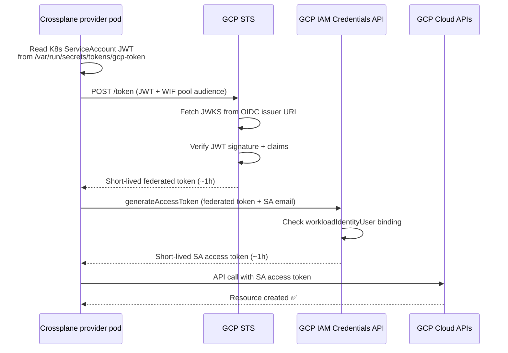
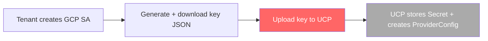
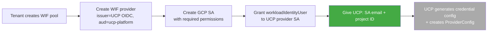

# Workload Identity Federation (WIF) on GCP — Feasibility for UCP

| | |
|---|---|
| **Author** | aripermana.putra |
| **Date** | 2026-07-02 |
| **Ticket** | MCUCP-217 |
| **Related** | [Cloud Provider Authorization — Service Account Strategy](./cloud-provider-authz-model.md) |

---

## Summary

UCP currently authenticates to GCP using long-lived Service Account keys uploaded by tenant admins, stored as Kubernetes Secrets, and referenced by Crossplane `ProviderConfig`. CCoE guardrail GP 291 auto-disables any SA key that is publicly exposed, and GP 106 signals organizational intent to move toward Workload Identity Federation (WIF) for workloads accessing GCP from outside GCP.

This document evaluates how WIF works, whether it is a viable replacement for long-lived SA keys in UCP's Crossplane-based provisioning model, and what the impact on tenant onboarding would be.

**Verdict:** WIF is technically viable for UCP. The PoC (MCUCP-217) confirmed that `provider-upjet-gcp` v2.6.0 works end-to-end using `Secret` + `external_account` credentials on a self-hosted non-GKE cluster. The remaining production blocker is GP 106 — CCoE must add UCP's OIDC issuer URL to the `constraints/iam.workloadIdentityPoolProviders` allowed list before tenants can register WIF providers in their GCP projects.

---

## Problem

UCP uses long-lived GCP Service Account keys as the credential for all Crossplane provisioning operations per tenant. These keys:

- Never expire unless explicitly revoked or rotated
- Are stored as Kubernetes Secrets (plaintext in etcd unless encryption at rest is configured)
- Are shared in bulk by tenant admins — UCP has no insight into when the tenant last rotated them
- Are automatically disabled by GCP (GP 291) if publicly exposed — this would silently break all provisioning for a tenant with no prior warning in UCP

The current model also makes UCP non-compliant with the spirit of GP 291, which states teams should avoid creating long-lived SA keys entirely where avoidable.

---

## Why It Matters

- **Operational risk:** a silently disabled SA key (triggered by GP 291) stops all provisioning for that tenant immediately. UCP has no mechanism to detect this or alert the tenant today.
- **Security posture:** long-lived keys stored in K8s Secrets are a credential exfiltration risk. The existing authz research ([cloud-provider-authz-model.md](./cloud-provider-authz-model.md)) identified this as the primary post-MVP risk.
- **CCoE alignment:** GP 291 and GP 106 together signal a clear organizational direction toward keyless authentication for workloads. While not yet a hard blocker for UCP, alignment with CCoE's direction reduces future compliance debt.
- **GP 106 is a potential active blocker for WIF itself** (see below).

---

## How WIF Works

WIF replaces a key file with a trust relationship. Instead of "here is a private key proving I am this SA," the workload says "here is a token from a trusted issuer — grant me access."

### Core flow



No private key is ever created or stored. The GCP SDK handles token exchange automatically when given a **credential configuration file** (not a key file):

```json
{
  "type": "external_account",
  "audience": "//iam.googleapis.com/projects/PROJECT_NUMBER/locations/global/workloadIdentityPools/POOL_ID/providers/PROVIDER_ID",
  "subject_token_type": "urn:ietf:params:oauth:token-type:jwt",
  "token_url": "https://sts.googleapis.com/v1/token",
  "credential_source": {
    "file": "/var/run/secrets/tokens/gcp-token"
  },
  "service_account_impersonation_url": "https://iamcredentials.googleapis.com/v1/projects/-/serviceAccounts/SA_EMAIL:generateAccessToken"
}
```

This file contains no secrets — it is safe to store in a ConfigMap or Kubernetes Secret.

### Critical prerequisite 1: OIDC issuer reachability

For GCP STS to verify the K8s ServiceAccount JWT, it must be able to fetch the JWKS (public keys) from the K8s cluster's OIDC discovery endpoint. The issuer URL embedded in the JWT must be publicly reachable by GCP.

**Current state of UCP's cluster:**

The OIDC issuer for the current cluster is `https://kubernetes.default.svc.cluster.local` — a cluster-internal address. GCP STS cannot reach this. WIF in standard OIDC mode cannot work with this configuration without remediation.

Possible remediations:

1. **Reconfigure the K8s API server** with a public OIDC issuer URL (`--service-account-issuer`) and host the JWKS at a publicly accessible endpoint. Requires cluster admin coordination and an infrastructure change.
2. **Run UCP on GKE** — GKE Workload Identity does not require a public OIDC endpoint. GKE handles OIDC discovery internally through Google's infrastructure. Cleanest path if GKE is the intended production environment.
3. **Self-hosted JWKS endpoint** — host the cluster's public signing keys at a URL GCP can reach, without exposing the API server itself. More complex but avoids a full cluster reconfiguration.
4. **Upload JWKS directly to the WIF provider** — when creating the WIF provider in GCP, the JWKS file can be uploaded directly instead of letting GCP fetch it from the issuer URL. GCP then uses the uploaded keys for token verification, bypassing the reachability requirement entirely. **Not recommended for production** — the JWKS must be manually re-uploaded every time the cluster is recreated (new key pair), creating an operational risk. Used as a PoC workaround only.

### Critical prerequisite 2: GP 106 — WIF provider allowlist

GP 106 (`constraints/iam.workloadIdentityPoolProviders`) is **not a blanket ban on WIF**. It is a list constraint that defines which identity provider URIs are allowed when configuring Workload Identity Pool Providers in a GCP project.

This has a direct impact on UCP: when a tenant configures a WIF pool provider pointing to UCP's K8s OIDC issuer URL, that issuer URL must be on CCoE's approved list. If it is not, GCP will block the WIF provider creation at the org policy level — and WIF becomes unusable for UCP regardless of whether the OIDC endpoint is reachable.

GP 106 applies to **L1 Compliant Systems**. The PoC confirmed that `sub-gcp-ucp-clsd-sandbox` is L1 — GP 106 is enforced and blocked WIF provider creation with our issuer URL. The allowed list on that project contains six approved URIs including one AKS cluster OIDC issuer, which is a direct precedent for requesting UCP's cluster issuer to be added.

CCoE must add UCP's production OIDC issuer URL to the allowed list before tenants can use WIF in their GCP projects.

---

## Impact on Tenant Onboarding

### Current flow (SA key)



Secret material shared with UCP: **yes — full SA key JSON**

### Proposed flow (WIF)



Secret material shared with UCP: **none**

More steps than the SA key flow, but all tenant-side steps are GCP Console or `gcloud` operations. UCP provides the exact principal string and step-by-step instructions to the tenant.

---

## Crossplane ProviderConfig Support

Crossplane's `provider-upjet-gcp` uses the GCP SDK internally. The SDK supports the `external_account` credential type natively via Application Default Credentials (ADC). The `ProviderConfig` would reference the credential config file via a K8s Secret (the file has no secret content but Crossplane's credential reference mechanism requires a Secret):

```yaml
apiVersion: gcp.upbound.io/v1beta1
kind: ProviderConfig
metadata:
  name: tenant-foo-gcp
spec:
  projectID: tenant-foo-project
  credentials:
    source: Secret
    secretRef:
      namespace: crossplane-system
      name: tenant-foo-wif-config
      key: credentials.json  # external_account JSON — contains no private key
```

The provider pod also needs a **projected ServiceAccount token volume** mounted at the path referenced in the credential config. This is configured via `DeploymentRuntimeConfig` — confirmed working in the PoC. The projected volume audience must be set to a fixed value (`ucp-platform`) that all tenants configure in their WIF providers, enabling multi-tenant use from a single shared provider pod.

---

## Options

### Option A — Keep long-lived SA keys, add operational controls (current model)

No change to credential model. Address GP 291 risk operationally:
- Track key upload timestamp; alert tenant admin when key is older than 90 days
- Monitor ProviderConfig health; detect GCP 401/403 responses and surface a "credential invalid" alert before the tenant discovers it through a failed provisioning

**Pros:** no onboarding change, no infrastructure prerequisite, works today.
**Cons:** GP 291 risk remains; key exfiltration risk remains; CCoE alignment gap persists.

### Option B — WIF with public K8s OIDC issuer

Reconfigure UCP's K8s cluster with a publicly reachable OIDC issuer URL. Tenants create a WIF pool + provider in their project. Crossplane uses a projected K8s SA token for GCP STS exchange.

**Pros:** no long-lived keys; tokens auto-rotate; aligns with CCoE GP 291 direction.
**Cons:** requires K8s infrastructure change (public OIDC issuer); more complex tenant onboarding; requires Crossplane provider pod changes (projected token volume).

### Option C — WIF via GKE Workload Identity (if UCP runs on GKE)

If UCP's control plane runs on GKE, GKE Workload Identity handles OIDC internally — no public OIDC endpoint or projected token volumes needed. The K8s ServiceAccount is linked to a GCP SA via a single annotation.

**Pros:** cleanest path — GKE manages all OIDC plumbing; no token volume projection needed.
**Cons:** requires UCP control plane to run on GKE; still requires per-tenant WIF pool configuration in each tenant's GCP project.

### Option D — Hybrid: WIF for UCP's own GCP access, SA keys for tenant operations

UCP's infrastructure-level GCP access (org policy checks, project verification) uses WIF. Tenant provisioning continues to use SA keys with the operational controls from Option A.

**Pros:** no onboarding change for tenants; UCP's own GCP access becomes keyless.
**Cons:** does not eliminate the SA key risk for tenant operations, which is the larger blast radius.

---

## Recommendation

**Short term (MVP):** Option A — keep SA keys, add operational controls. This unblocks MVP without infrastructure dependencies.

**Medium term:** pursue Option C if GKE is the intended production cluster, Option B otherwise. But before any WIF work proceeds, two blockers must be resolved outside the PoC:

1. **GP 106 allowlist** — confirm with CCoE whether UCP's OIDC issuer URL can be added to `constraints/iam.workloadIdentityPoolProviders`, and whether tenant projects are L1-classified. If neither condition can be met, WIF is not a viable path for UCP regardless of technical feasibility.
2. **OIDC issuer reachability** — confirm whether GKE is the production target (resolves this automatically) or whether the K8s cluster will be reconfigured with a public issuer.

Only after these two are resolved should the PoC (MCUCP-217) proceed to verify:
- Whether `provider-upjet-gcp` works end-to-end with a WIF credential config and projected token volume
- What tenant onboarding looks like in practice, and whether it can be automated

---

## Open Questions

- Is UCP's production control plane intended to run on GKE? This determines whether Option B (public OIDC issuer) or Option C (GKE-managed OIDC) is the right path.
- Can CCoE add UCP's OIDC issuer URL to `constraints/iam.workloadIdentityPoolProviders`? The AKS cluster entry in the allowed list is a direct precedent.
- What is the migration path for existing tenants with SA keys when UCP moves to WIF?

---

## Related PoCs

- [WIF — GCP Workload Identity Federation with Crossplane](../pocs/wif-gcp.md) — `Secret` + `external_account` works end-to-end on a self-hosted non-GKE cluster. Production blocked by GP 106 — requires CCoE to add UCP's issuer URL to the allowed list. (MCUCP-217)

---

## References

- [GCP Workload Identity Federation — overview](https://cloud.google.com/iam/docs/workload-identity-federation)
- [WIF with Kubernetes — official guide](https://cloud.google.com/iam/docs/workload-identity-federation-with-kubernetes)
- [GKE Workload Identity — official guide](https://cloud.google.com/kubernetes-engine/docs/how-to/workload-identity)
- [GCP WIF best practices — disable pool creation](https://cloud.google.com/iam/docs/best-practices-for-using-workload-identity-federation#disable-pool-creation)
- [GCP org policy constraints reference](https://cloud.google.com/resource-manager/docs/organization-policy/org-policy-constraints)
- [Crossplane GCP ProviderConfig — credential sources](https://docs.crossplane.io/latest/concepts/providers/)
- [GCP external_account credential type (ADC)](https://google.aip.dev/auth/4117)
- [Cloud Provider Authorization — Service Account Strategy](./cloud-provider-authz-model.md)
- [CCoE Public Cloud Infrastructure Guardrails v2 — GP 106, GP 125](https://confluence.rakuten-it.com/confluence/spaces/CLOUDSOL/pages/5411030282/Public+Cloud+Infrastructure+Guardrails+Version+2)
- [UCP Policy Enforcement — GP 291, guardrail coverage](https://confluence.rakuten-it.com/confluence/spaces/UCP/pages/6671968824/Policy+enforcement)
