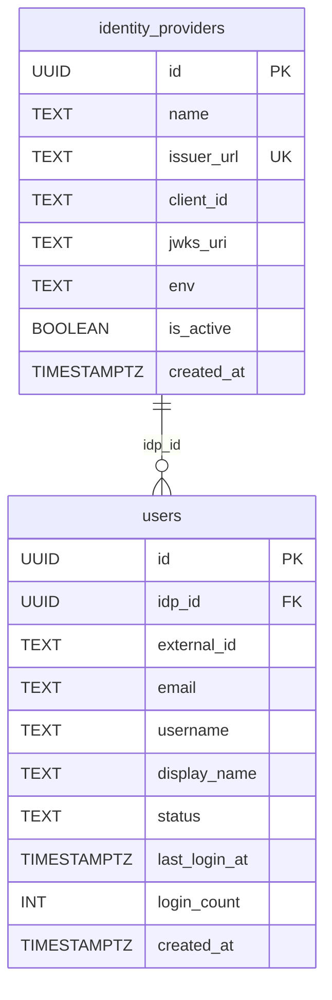
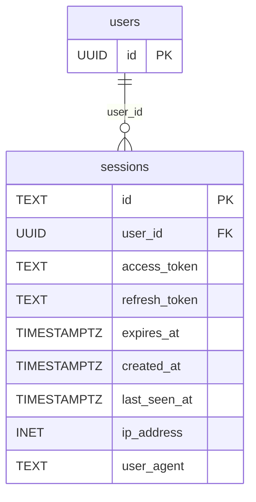
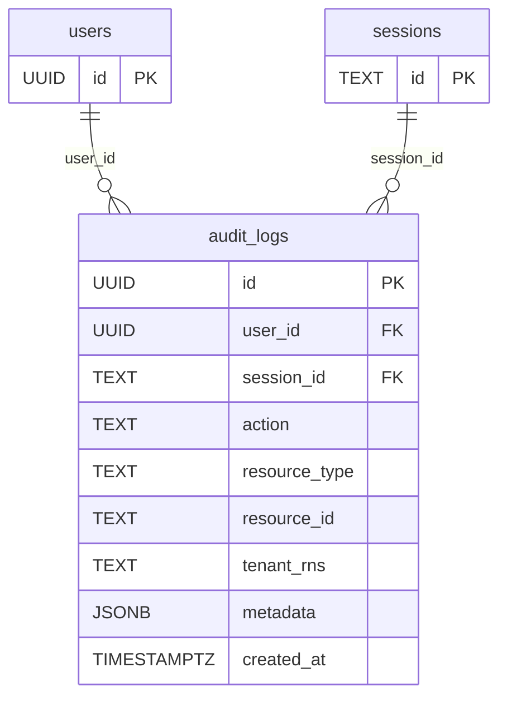
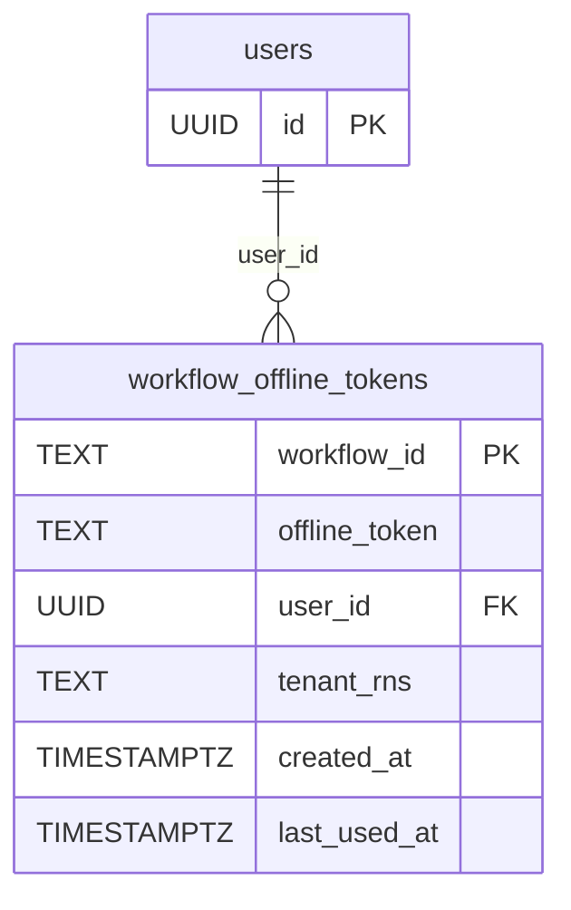

# Task Breakdown — MCUCP-129: US 1.1 — SSO Authentication

**Story:** [MCUCP-129](https://jira.rakuten-it.com/jira/browse/MCUCP-129)
**Parent task:** MCUCP-263

**Business scope:** UCP users log in via ROC Keycloak SSO — no separate UCP account required. Both CLI (interactive PKCE flow) and direct API access (bearer token, for CI/CD) authenticate against the same identity provider. UCP creates a user record on first login for audit attribution, validates every request via JWKS, and logs authentication events.

**Codebase:** monorepo at `ucp-platform/`. Feature slice implementation lives under `api-server/internal/<feature>/`. Shared cross-cutting code lives under `api-server/internal/shared/`. API contract is defined in `api-server/api/openapi.yaml` — server stubs (`api-server/gen/api.gen.go`) and CLI client (`cli/gen/client.gen.go`) are generated from it via `make generate`.

---

## Subtask 1: JWT validation middleware + JIT user provisioning
**Components:** API Server, Platform DB
**Blocks:** Subtask 3, Subtask 5, Subtask 6

### API Contract
No new endpoints. Introduces the shared OpenAPI components that all subsequent subtasks depend on.

Add to `api-server/api/openapi.yaml`:

```yaml
components:
  securitySchemes:
    bearerAuth:
      type: http
      scheme: bearer
      bearerFormat: JWT
    sessionCookie:
      type: apiKey
      in: cookie
      name: session

  responses:
    Unauthorized:
      description: Missing or invalid authentication
      content:
        application/json:
          schema:
            $ref: "#/components/schemas/ErrorResponse"
    Forbidden:
      description: Insufficient permissions
      content:
        application/json:
          schema:
            $ref: "#/components/schemas/ErrorResponse"
    BadRequest:
      description: Invalid request
      content:
        application/json:
          schema:
            $ref: "#/components/schemas/ErrorResponse"
    NotFound:
      description: Resource not found
      content:
        application/json:
          schema:
            $ref: "#/components/schemas/ErrorResponse"
    InternalError:
      description: Internal server error
      content:
        application/json:
          schema:
            $ref: "#/components/schemas/ErrorResponse"
    BadGateway:
      description: Upstream service error
      content:
        application/json:
          schema:
            $ref: "#/components/schemas/ErrorResponse"

  schemas:
    ErrorResponse:
      type: object
      required: [code, message, requestId]
      properties:
        code:
          type: string
          example: UNAUTHENTICATED
        message:
          type: string
          example: "No valid session token. Run 'ucp auth login'."
        requestId:
          type: string
          format: uuid
```

### Implementation
Implement in `api-server/internal/shared/middleware/`:

- Implement JWT validation middleware for Echo: extract token from `Authorization: Bearer <token>` header or `UCP_TOKEN` env var (env var takes precedence), validate JWT signature against the JWKS endpoint of the matching `identity_providers` record with a 5-minute in-memory TTL cache, extract `sub`, `email`, `preferred_username`, `groups` claims, inject `Principal` into Echo context
- On first request for a given user: insert a user record via `INSERT ... ON CONFLICT (idp_id, external_id) DO UPDATE` (JIT provisioning)
- On missing, malformed, or expired token: return `DomainError` with code `UNAUTHENTICATED` and HTTP 401 — routed through Echo's global `HTTPErrorHandler`
- Implement TLS config at startup: per-endpoint boolean flags (`TLS_SKIP_VERIFY_KEYCLOAK`, `TLS_SKIP_VERIFY_HORIZON`, `TLS_SKIP_VERIFY_OMNIA`) read from env, default `false`. Passed as constructor arguments in `cmd/api-server/main.go` wiring. Log a startup warning when any flag is `true`.

> **Open question:** if the DB is unavailable during JIT provisioning, fail closed (HTTP 500) or fail open (proceed without a `Principal`)? Must be decided before MVP.

### DB Schema



```sql
CREATE TABLE identity_providers (
    id         UUID        PRIMARY KEY DEFAULT gen_random_uuid(),
    name       TEXT        NOT NULL,
    issuer_url TEXT        NOT NULL,
    client_id  TEXT        NOT NULL,
    jwks_uri   TEXT        NOT NULL,
    env        TEXT        NOT NULL CHECK (env IN ('dev', 'stg', 'prod')),
    is_active  BOOLEAN     NOT NULL DEFAULT true,
    created_at TIMESTAMPTZ NOT NULL DEFAULT now(),
    UNIQUE (issuer_url)
);

CREATE TABLE users (
    id            UUID        PRIMARY KEY DEFAULT gen_random_uuid(),
    idp_id        UUID        NOT NULL REFERENCES identity_providers(id),
    external_id   TEXT        NOT NULL,
    email         TEXT        NOT NULL,
    username      TEXT        NOT NULL,
    display_name  TEXT        NOT NULL DEFAULT '',
    status        TEXT        NOT NULL DEFAULT 'active' CHECK (status IN ('active', 'suspended')),
    last_login_at TIMESTAMPTZ,
    login_count   INT         NOT NULL DEFAULT 0,
    created_at    TIMESTAMPTZ NOT NULL DEFAULT now(),
    UNIQUE (idp_id, external_id)
);

CREATE INDEX idx_users_email ON users(email);
```

---

## Subtask 2: API Server login flow (PKCE)
**Components:** API Server, Platform DB
**Blocked by:** Subtask 1
**Blocks:** Subtask 3, Subtask 4, MCUCP-220 Subtask 1

### API Contract
Add to `api-server/api/openapi.yaml`:

```yaml
paths:
  /auth/login:
    get:
      operationId: initiateLogin
      summary: Initiate Keycloak PKCE login flow
      tags: [auth]
      responses:
        "302":
          description: Redirect to Keycloak authorize endpoint
          headers:
            Location:
              schema:
                type: string
            Set-Cookie:
              description: HMAC-signed encrypted state cookie
              schema:
                type: string
        "500":
          $ref: "#/components/responses/InternalError"

  /auth/callback:
    get:
      operationId: handleCallback
      summary: Keycloak OIDC redirect callback
      tags: [auth]
      parameters:
        - name: code
          in: query
          required: true
          schema:
            type: string
        - name: state
          in: query
          required: true
          schema:
            type: string
      responses:
        "302":
          description: Redirect to app root on success; sets AES-GCM encrypted session cookie (HttpOnly, SameSite=Strict, Secure)
          headers:
            Location:
              schema:
                type: string
            Set-Cookie:
              schema:
                type: string
        "400":
          $ref: "#/components/responses/BadRequest"
        "502":
          $ref: "#/components/responses/BadGateway"
```

### Implementation
Implement in `api-server/internal/auth/`:

- `initiateLogin`: generate PKCE code verifier + challenge, generate state, set HMAC-signed encrypted state cookie, redirect to Keycloak `/authorize`
- `handleCallback`: validate state cookie, exchange code + PKCE verifier for tokens via Keycloak, validate ID token signature via JWKS, create session record with AES-GCM encrypted tokens, set `HttpOnly + SameSite=Strict + Secure` session cookie, redirect to app root. A new login does **not** invalidate existing sessions — concurrent sessions are allowed in MVP.
- Session middleware (Echo middleware in `internal/shared/middleware/`): validate session cookie on each request, inject `Principal` into context. On invalid or expired session: return `DomainError` with `UNAUTHENTICATED`.

### DB Schema



```sql
CREATE TABLE sessions (
    id            TEXT        PRIMARY KEY,
    user_id       UUID        NOT NULL REFERENCES users(id) ON DELETE CASCADE,
    access_token  TEXT        NOT NULL,
    refresh_token TEXT        NOT NULL,
    expires_at    TIMESTAMPTZ NOT NULL,
    created_at    TIMESTAMPTZ NOT NULL DEFAULT now(),
    last_seen_at  TIMESTAMPTZ NOT NULL DEFAULT now(),
    ip_address    INET,
    user_agent    TEXT
);

CREATE INDEX idx_sessions_user_id    ON sessions(user_id);
CREATE INDEX idx_sessions_expires_at ON sessions(expires_at);
```

---

## Subtask 3: CLI login flow
**Components:** CLI
**Blocked by:** Subtask 1

### CLI Definition
Implement in `cli/`. This command talks directly to Keycloak — it does not go through the UCP API. No generated client is involved.

```
ucp auth login [--server <url>]

FLAGS:
  --server    UCP server URL (defaults to configured server)
```

Flow: start local callback server on port 18080 → open system browser to Keycloak authorize URL → receive authorization code on redirect → exchange code + PKCE verifier for tokens → store tokens in OS keychain (macOS Keychain, Linux SecretService, Windows Credential Manager) with encrypted JSON fallback at `~/.ucp/credentials`, indexed by server URL.

| Outcome | Output |
|---|---|
| Success | `Logged in as taro.rakuten@rakuten.com`<br>`Run 'ucp help' to see all available commands.` |
| Port 18080 unavailable | `Error: port 18080 is already in use. Free the port and run 'ucp auth login' again.` |
| Browser could not open | `Opening browser for login...`<br>`If your browser did not open, visit the following URL to complete login:`<br>`<authorize-url>` |
| Login cancelled or timed out | `Error: login was cancelled or timed out. Run 'ucp auth login' to try again.` |
| Token expired (on any subsequent command) | `Session expired. Run 'ucp auth login' to re-authenticate.` |

---

## Subtask 4: Auth login audit logging
**Components:** API Server, Platform DB
**Blocked by:** Subtask 2

### Implementation
No new endpoints. Implement audit write inside the `handleCallback` handler (session-based login) and inside the JWT middleware (bearer token first use).

Implement a shared `AuditService` in `api-server/internal/shared/audit/` that writes to `audit_logs`. Inject it as a constructor dependency.

| Field | Value |
|---|---|
| `user_id` | resolved UCP user UUID |
| `action` | `auth.login` |
| `session_id` | session ID for session-based login; `null` for bearer token |
| `metadata` | `{}` (ip_address and failure tracking are Phase 2) |
| `created_at` | event timestamp |

### DB Schema



```sql
CREATE TABLE audit_logs (
    id            UUID        PRIMARY KEY DEFAULT gen_random_uuid(),
    user_id       UUID        REFERENCES users(id) ON DELETE SET NULL,
    session_id    TEXT        REFERENCES sessions(id) ON DELETE SET NULL,
    action        TEXT        NOT NULL,
    resource_type TEXT,
    resource_id   TEXT,
    tenant_rns    TEXT,
    metadata      JSONB,
    created_at    TIMESTAMPTZ NOT NULL DEFAULT now()
);

CREATE INDEX idx_audit_logs_user_id    ON audit_logs(user_id);
CREATE INDEX idx_audit_logs_action     ON audit_logs(action);
CREATE INDEX idx_audit_logs_tenant_rns ON audit_logs(tenant_rns);
CREATE INDEX idx_audit_logs_created_at ON audit_logs(created_at DESC);
```

---

## Subtask 5: Offline token flow for Temporal workflows
**Components:** API Server, Platform DB
**Blocked by:** Subtask 2

> **External dependency:** confirm with the ROC Auth team that the UCP Keycloak client allows `offline_access` scope before this subtask starts. If not supported, fall back to a regular refresh token and document the accepted risk.

### Implementation
No new endpoints. Implement inside the workflow submission handler (separate story) as an extension point. Defined here for the DB schema.

At workflow submission: request `offline_access` scoped token from Keycloak, persist in `workflow_offline_tokens` linked to the workflow ID. On workflow resume: exchange the offline token for a fresh access token and re-evaluate the user's `groups` claim. On workflow completion or cancellation: revoke the offline token via Keycloak `/logout` and delete the row.

### DB Schema



```sql
CREATE TABLE workflow_offline_tokens (
    workflow_id   TEXT        PRIMARY KEY,
    offline_token TEXT        NOT NULL,
    user_id       UUID        NOT NULL REFERENCES users(id),
    tenant_rns    TEXT        NOT NULL,
    created_at    TIMESTAMPTZ NOT NULL DEFAULT now(),
    last_used_at  TIMESTAMPTZ
);

CREATE INDEX idx_workflow_tokens_user_id ON workflow_offline_tokens(user_id);
```

---

## Open Questions
1. **Fail-open vs fail-closed on DB unavailability during JIT provisioning** — must be decided before MVP.
2. **Offline token `offline_access` scope** — requires ROC Auth team confirmation before Subtask 5 starts.
3. **Multiple ROC roles for the same service in JWT `groups` claim** — define the correct resolution strategy (e.g. last-parsed, highest role) before MVP.
