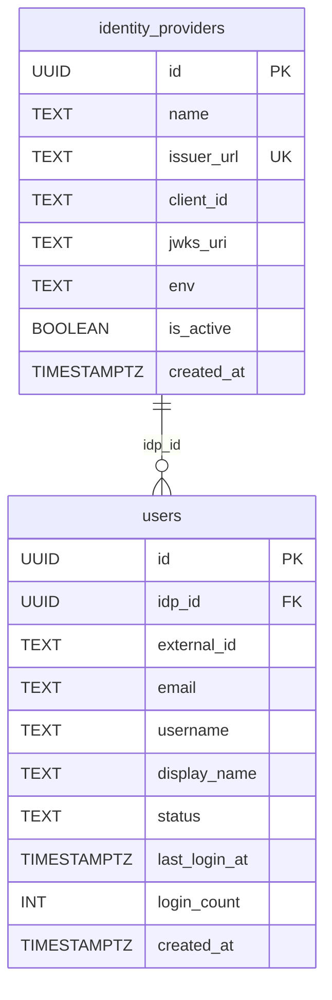
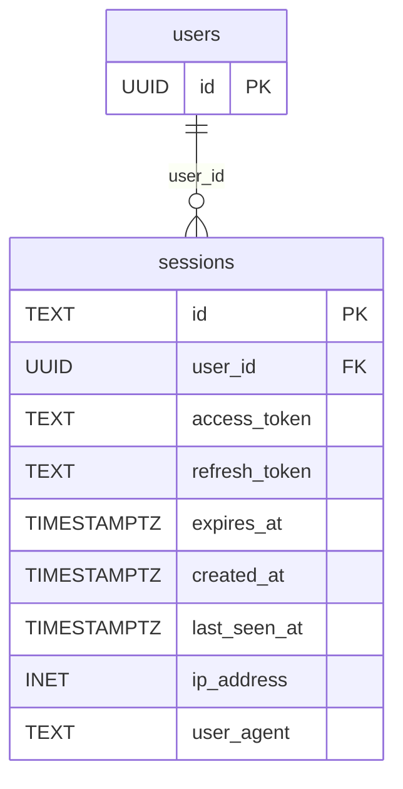
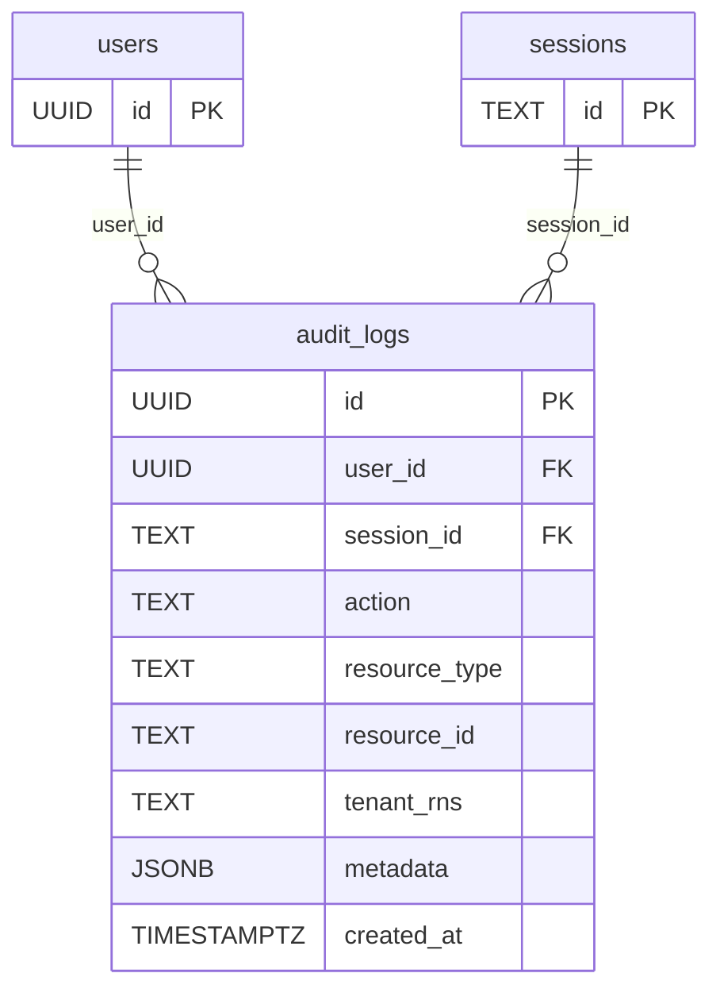
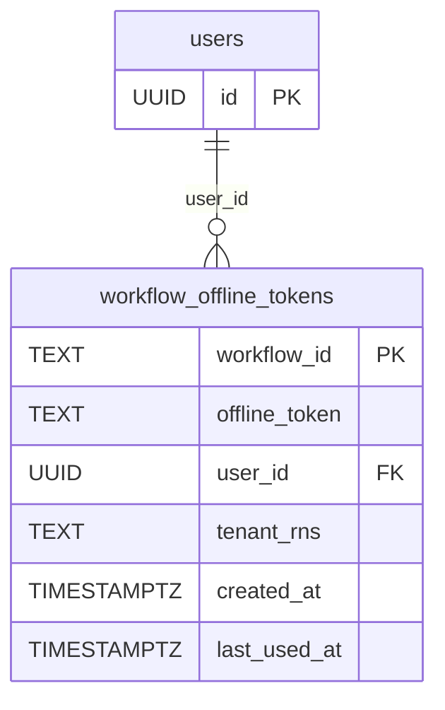

# Task Breakdown — MCUCP-129: US 1.1 — SSO Authentication

**Story:** [MCUCP-129](https://jira.rakuten-it.com/jira/browse/MCUCP-129)
**Parent task:** MCUCP-263

**Business scope:** UCP users log in via ROC Keycloak SSO — no separate UCP account required. Both CLI (interactive PKCE flow) and direct API access (bearer token, for CI/CD) authenticate against the same identity provider. UCP creates a user record on first login for audit attribution, validates every request via JWKS, and logs authentication events.

---

## Subtask 1: JWT validation middleware + JIT user provisioning
**Components:** API Server, Platform DB
**Blocks:** Subtask 3, Subtask 5, Subtask 6

### Changes
Middleware applied to all protected routes — not a new endpoint.

- Extract token from `Authorization: Bearer <token>` header or `UCP_TOKEN` env var (env var takes precedence, for CI/CD use)
- Validate JWT signature against the JWKS endpoint of the matching `identity_providers` record; cache JWKS with a 5-minute in-memory TTL
- On valid token: extract `sub`, `email`, `preferred_username`, `groups` claims → inject `Principal` into request context → upsert user record (JIT provisioning via `INSERT ... ON CONFLICT (idp_id, external_id)`)
- On missing, malformed, or expired token → return HTTP 401

**401 response (all protected routes):**
```json
{ "code": "UNAUTHENTICATED", "message": "No valid session token. Run 'ucp auth login'." }
```

> **Open question:** if the DB is unavailable during JIT provisioning, fail closed (HTTP 500) or fail open (proceed without a `Principal`)? Must be decided before MVP.

### DB Schema



```sql
CREATE TABLE identity_providers (
    id         UUID        PRIMARY KEY DEFAULT gen_random_uuid(),
    name       TEXT        NOT NULL,
    issuer_url TEXT        NOT NULL,
    client_id  TEXT        NOT NULL,
    jwks_uri   TEXT        NOT NULL,
    env        TEXT        NOT NULL CHECK (env IN ('dev', 'stg', 'prod')),
    is_active  BOOLEAN     NOT NULL DEFAULT true,
    created_at TIMESTAMPTZ NOT NULL DEFAULT now(),
    UNIQUE (issuer_url)
);

CREATE TABLE users (
    id            UUID        PRIMARY KEY DEFAULT gen_random_uuid(),
    idp_id        UUID        NOT NULL REFERENCES identity_providers(id),
    external_id   TEXT        NOT NULL,
    email         TEXT        NOT NULL,
    username      TEXT        NOT NULL,
    display_name  TEXT        NOT NULL DEFAULT '',
    status        TEXT        NOT NULL DEFAULT 'active' CHECK (status IN ('active', 'suspended')),
    last_login_at TIMESTAMPTZ,
    login_count   INT         NOT NULL DEFAULT 0,
    created_at    TIMESTAMPTZ NOT NULL DEFAULT now(),
    UNIQUE (idp_id, external_id)
);

CREATE INDEX idx_users_email ON users(email);
```

---

## Subtask 2: TLS per-endpoint verification configuration
**Components:** API Server
**Blocks:** Subtask 3

### Changes
- Remove all hardcoded `InsecureSkipVerify: true` across all files
- Replace with per-endpoint deploy-time env vars (default `false` — verify):

| Env var | Applies to |
|---|---|
| `TLS_SKIP_VERIFY_KEYCLOAK` | Keycloak OIDC + JWKS calls |
| `TLS_SKIP_VERIFY_HORIZON` | Horizon Core Data API calls |
| `TLS_SKIP_VERIFY_OMNIA` | Omnia service calls |

- Production sets none. STG/QA sets the relevant flags explicitly.
- Add a startup log warning when any `TLS_SKIP_VERIFY_*` is `true`

---

## Subtask 3: API Server login flow (PKCE)
**Components:** API Server, Platform DB
**Blocked by:** Subtask 1, Subtask 2
**Blocks:** Subtask 5, Subtask 6, MCUCP-220 Subtask 1

### API Contract

**`GET /auth/login`**

Initiates the PKCE flow — redirects the caller to Keycloak.

| | |
|---|---|
| Auth required | No |
| Response | `302 Found` — `Location: <keycloak-authorize-url>` |

Sets an HMAC-signed encrypted state cookie before redirecting.

---

**`GET /auth/callback`**

Keycloak redirect target. Exchanges the authorization code for tokens, creates a session, and sets a session cookie.

| | |
|---|---|
| Auth required | No |
| Query params | `code` (string, required), `state` (string, required) |

| Status | Condition | Body / Headers |
|---|---|---|
| `302 Found` | Success | `Location: /` — `Set-Cookie: session=<encrypted>; HttpOnly; SameSite=Strict; Secure` |
| `400 Bad Request` | State cookie mismatch or missing | `{ "code": "BAD_REQUEST", "message": "Invalid or expired state parameter." }` |
| `502 Bad Gateway` | Keycloak token exchange failure | `{ "code": "UPSTREAM_ERROR", "message": "Failed to exchange authorization code with identity provider." }` |

Session cookie: AES-GCM encrypted tokens, `HttpOnly`, `SameSite=Strict`, `Secure`. A new login does **not** invalidate existing sessions on other devices — concurrent sessions are allowed in MVP.

**Session middleware (applied to all protected routes)**

Validates the session cookie on each request and injects `Principal` into context. On expired or invalid session → standard HTTP 401 response. Token TTL follows ROC Keycloak configuration; UCP does not extend it.

### DB Schema



```sql
CREATE TABLE sessions (
    id            TEXT        PRIMARY KEY,
    user_id       UUID        NOT NULL REFERENCES users(id) ON DELETE CASCADE,
    access_token  TEXT        NOT NULL,
    refresh_token TEXT        NOT NULL,
    expires_at    TIMESTAMPTZ NOT NULL,
    created_at    TIMESTAMPTZ NOT NULL DEFAULT now(),
    last_seen_at  TIMESTAMPTZ NOT NULL DEFAULT now(),
    ip_address    INET,
    user_agent    TEXT
);

CREATE INDEX idx_sessions_user_id    ON sessions(user_id);
CREATE INDEX idx_sessions_expires_at ON sessions(expires_at);
```

---

## Subtask 4: CLI login flow
**Components:** CLI
**Blocked by:** Subtask 1

### CLI Definition

```
ucp auth login [--server <url>]

FLAGS:
  --server    UCP server URL (defaults to configured server)
```

Flow: starts a local callback server on port 18080 → opens system browser to Keycloak authorize URL → receives authorization code on callback redirect → exchanges code + PKCE verifier for tokens → stores tokens in OS keychain (macOS Keychain, Linux SecretService, Windows Credential Manager) with encrypted JSON fallback at `~/.ucp/credentials`, indexed by server URL.

| Outcome | Output |
|---|---|
| Success | `Logged in as taro.rakuten@rakuten.com`<br>`Run 'ucp help' to see all available commands.` |
| Port 18080 unavailable | `Error: port 18080 is already in use. Free the port and run 'ucp auth login' again.` |
| Browser could not open | `Opening browser for login...`<br>`If your browser did not open, visit the following URL to complete login:`<br>`<authorize-url>` |
| Login cancelled or timed out | `Error: login was cancelled or timed out. Run 'ucp auth login' to try again.` |
| Token expired (on any subsequent command) | `Session expired. Run 'ucp auth login' to re-authenticate.` |

---

## Subtask 5: Auth login audit logging
**Components:** API Server, Platform DB
**Blocked by:** Subtask 1, Subtask 3

### Changes
Write an `auth.login` entry to `audit_logs` on every successful login across all authentication paths. Implement via shared helper — not per-handler — to guarantee consistent coverage.

| Field | Value |
|---|---|
| `user_id` | resolved UCP user UUID |
| `action` | `auth.login` |
| `session_id` | session ID if session-based; `null` for bearer token |
| `metadata` | `{}` (ip_address and failure tracking are Phase 2) |
| `created_at` | event timestamp |

### DB Schema



```sql
CREATE TABLE audit_logs (
    id            UUID        PRIMARY KEY DEFAULT gen_random_uuid(),
    user_id       UUID        REFERENCES users(id) ON DELETE SET NULL,
    session_id    TEXT        REFERENCES sessions(id) ON DELETE SET NULL,
    action        TEXT        NOT NULL,
    resource_type TEXT,
    resource_id   TEXT,
    tenant_rns    TEXT,
    metadata      JSONB,
    created_at    TIMESTAMPTZ NOT NULL DEFAULT now()
);

CREATE INDEX idx_audit_logs_user_id    ON audit_logs(user_id);
CREATE INDEX idx_audit_logs_action     ON audit_logs(action);
CREATE INDEX idx_audit_logs_tenant_rns ON audit_logs(tenant_rns);
CREATE INDEX idx_audit_logs_created_at ON audit_logs(created_at DESC);
```

---

## Subtask 6: Offline token flow for Temporal workflows
**Components:** API Server, Platform DB
**Blocked by:** Subtask 3

> **External dependency:** confirm with the ROC Auth team that the UCP Keycloak client allows `offline_access` scope before this subtask starts. If not supported, fall back to storing a regular refresh token and document the accepted risk.

### Changes
Temporal provisioning workflows can pause at manual approval gates for hours or days, outliving the user's access token TTL.

- At workflow submission time: request an `offline_access` scoped token from Keycloak and store it in `workflow_offline_tokens` associated with the workflow ID
- On workflow resume: exchange the offline token for a fresh access token; re-evaluate the user's `groups` claim at resume time. If the user no longer has a role on the tenant, the workflow fails with a clear error surfaced to the tenant-admin
- On workflow completion or cancellation: revoke the offline token via Keycloak `/logout` and delete the `workflow_offline_tokens` row

### DB Schema



```sql
CREATE TABLE workflow_offline_tokens (
    workflow_id   TEXT        PRIMARY KEY,
    offline_token TEXT        NOT NULL,
    user_id       UUID        NOT NULL REFERENCES users(id),
    tenant_rns    TEXT        NOT NULL,
    created_at    TIMESTAMPTZ NOT NULL DEFAULT now(),
    last_used_at  TIMESTAMPTZ
);

CREATE INDEX idx_workflow_tokens_user_id ON workflow_offline_tokens(user_id);
```

---

## Open Questions
1. **Fail-open vs fail-closed on DB unavailability during JIT provisioning** — must be decided before MVP.
2. **Offline token `offline_access` scope** — requires ROC Auth team confirmation before Subtask 6 starts.
3. **Multiple ROC roles for the same service in JWT `groups` claim** — last-parsed-wins is the current behavior. Define the correct resolution strategy before MVP.
