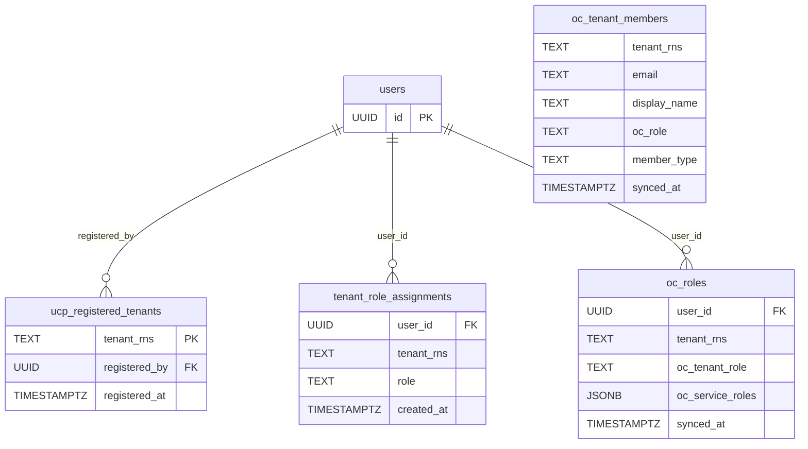

# Task Breakdown — MCUCP-138: US 1.5 — UCP RBAC Model

**Story:** [MCUCP-138](https://jira.rakuten-it.com/jira/browse/MCUCP-138)
**Parent task:** MCUCP-263

**Business scope:** All UCP API endpoints enforce a 3-role permission model (`tenant-admin`, `developer`, `viewer`) per tenant. Roles are assigned via ROC Portal. UCP enforces permissions on every request and logs authorization failures. Users can inspect their own role and available operations on any of their tenants.

**Codebase:** monorepo at `ucp-platform/`. Shared permission types and middleware in `api-server/internal/shared/`. Feature slice in `api-server/internal/auth/` for the whoami endpoint. API contract in `api-server/api/openapi.yaml`.

---

## Subtask 1: DB — RBAC schema
**Components:** Platform DB
**Blocks:** Subtask 2, Subtask 3, Subtask 4, Subtask 5, MCUCP-130 Subtask 1

### DB Schema



> `oc_tenant_members` has no FK to `users` — it stores all Horizon tenant members regardless of whether they have a UCP account, so the member list works before first login.

> `tenant_rns = '*'` in `tenant_role_assignments` is the sentinel for `platform-admin` (cross-tenant role, never touched by sync).

```sql
CREATE TABLE ucp_registered_tenants (
    tenant_rns    TEXT        PRIMARY KEY,
    registered_by UUID        REFERENCES users(id),
    registered_at TIMESTAMPTZ NOT NULL DEFAULT now()
);

CREATE TABLE tenant_role_assignments (
    user_id    UUID        NOT NULL REFERENCES users(id) ON DELETE CASCADE,
    tenant_rns TEXT        NOT NULL,
    role       TEXT        NOT NULL CHECK (role IN ('platform-admin', 'tenant-admin', 'developer', 'viewer')),
    created_at TIMESTAMPTZ NOT NULL DEFAULT now(),
    PRIMARY KEY (user_id, tenant_rns)
);

CREATE INDEX idx_role_assignments_tenant ON tenant_role_assignments(tenant_rns);

-- Populated by login-triggered OC sync (Subtask 4). Not used for access control.
CREATE TABLE oc_roles (
    user_id          UUID        NOT NULL REFERENCES users(id) ON DELETE CASCADE,
    tenant_rns       TEXT        NOT NULL,
    oc_tenant_role   TEXT        NOT NULL CHECK (oc_tenant_role IN ('Tenant Admin', 'Tenant Member')),
    oc_service_roles JSONB,
    synced_at        TIMESTAMPTZ NOT NULL DEFAULT now(),
    PRIMARY KEY (user_id, tenant_rns)
);

-- All Horizon members per tenant regardless of UCP login status.
-- Source for admin contact list in GET /api/v1/me/tenants.
CREATE TABLE oc_tenant_members (
    tenant_rns   TEXT        NOT NULL,
    email        TEXT        NOT NULL,
    display_name TEXT        NOT NULL DEFAULT '',
    oc_role      TEXT        NOT NULL CHECK (oc_role IN ('Tenant Admin', 'Tenant Member')),
    member_type  TEXT        NOT NULL DEFAULT 'user' CHECK (member_type IN ('user', 'service_account', 'team')),
    synced_at    TIMESTAMPTZ NOT NULL DEFAULT now(),
    PRIMARY KEY (tenant_rns, email)
);

CREATE INDEX idx_oc_members_email ON oc_tenant_members(email);
```

---

## Subtask 2: Permission types and role model
**Components:** API Server
**Blocked by:** Subtask 1
**Blocks:** Subtask 3

### Implementation
Implement in `api-server/internal/shared/auth/`:

- Implement permission bitmask types and role-to-permission map:

```
viewer:       PermRead
developer:    PermRead | PermProvision
tenant-admin: PermRead | PermProvision | PermApprove | PermManage
```

- `platform-admin` rows (sentinel `tenant_rns = '*'`) are preserved and assignable manually; never touched by any sync. `platform-admin` holds all permissions and passes every permission check regardless of tenant scope.

**Full permission matrix:**

| Operation | `viewer` | `developer` | `tenant-admin` |
|---|:---:|:---:|:---:|
| View inventory, cost, history, quota, audit log, GCP projects | ✅ | ✅ | ✅ |
| Provision & delete resources | ❌ | ✅ | ✅ |
| Cancel in-progress workflow | ❌ | ✅ | ✅ |
| Approve / reject provisioning workflows | ❌ | ❌ | ✅ |
| Register / update GCP projects | ❌ | ❌ | ✅ |
| Update quota limits | ❌ | ❌ | ✅ |
| Configure approval policies | ❌ | ❌ | ✅ |
| Configure drift response policy | ❌ | ❌ | ✅ |

---

## Subtask 3: `RequirePermission` middleware + authz failure logging
**Components:** API Server, Platform DB
**Blocked by:** Subtask 1, Subtask 2
**Blocks:** Subtask 5, MCUCP-130 Subtask 1

### Implementation
Implement in `api-server/internal/shared/middleware/`:

**Role resolution per request:**

The role source depends on the architectural decision (see Open Questions):

- **JWT-based:** parse `rns:roc:ucp::{tenant-slug}:roles:{role}` from the JWT `groups` claim directly — no DB call for role lookup at request time
- **DB-backed:** query `tenant_role_assignments WHERE user_id = $1 AND tenant_rns IN ($tenant, '*')` — at most 2 rows; cache result in request context for the duration of the request

Tenant context is derived from `?tenantId=` query param (GET requests) or `{tenantSlug}` path segment resolved to RNS via DB (mutation requests).

**`RequirePermission(perm)` Echo middleware behavior:**

1. Derive tenant from request
2. Resolve role (JWT or DB per above)
3. Map role → permission set via the permission map
4. If `permissions.Has(perm)` → store resolved role in context, call next handler
5. Else → write authz failure audit log entry via `AuditService` → return `DomainError` with `FORBIDDEN`

**403 `DomainError` messages:**

When user has no UCP role on the target tenant:
```
code: FORBIDDEN
message: "You do not have a UCP role on tenant 'coupon-team'. Contact your tenant-admin to get a role assigned in ROC Portal."
```

When user has a role but insufficient permission:
```
code: FORBIDDEN
message: "You do not have permission to perform this operation on tenant 'coupon-team'."
```

Both are routed through Echo's global `HTTPErrorHandler` — no per-handler error formatting.

**Authz failure audit entry (written on every 403 from this middleware):**

| Field | Value |
|---|---|
| `user_id` | resolved UCP user UUID |
| `action` | `authorization_failed` |
| `tenant_rns` | target tenant RNS (if known) |
| `metadata` | `{ "required_permission": "<perm name>" }` |
| `created_at` | event timestamp |

Uses `audit_logs` from MCUCP-129 Subtask 4 — no new table.

---

## Subtask 4: Login-triggered OC role sync
**Components:** API Server, Platform DB
**Blocked by:** Subtask 1
**Blocks:** Subtask 3 (DB must be populated for role checks to return correct results if DB-backed approach is chosen)

> **Conditional on DB-backed role resolution.** If the JWT-based approach is adopted, this subtask is not needed for MVP.

### Implementation
Implement in `api-server/internal/auth/` as part of the `handleCallback` handler — runs synchronously before the login redirect returns.

**Sync flow:**
1. Parse JWT `groups` claim to extract the logged-in user's own tenant list and OC tenant role (no Horizon call for own data)
2. For each tenant: `UPSERT oc_roles` with `oc_tenant_role` + `oc_service_roles` (JSONB from JWT service role entries)
3. Auto-assign `tenant-admin` in `tenant_role_assignments` for OC Tenant Admins on registered tenants (upgrade only — never downgrade a manually-granted higher role)
4. For each tenant where the logged-in user is an OC Tenant Admin: call `GET /v0/tenants/{rns}/members` (Horizon) to sync all other members into `oc_tenant_members` (required — other users' roles are not in the logged-in user's JWT)
5. Revoke UCP roles for tenants no longer in the JWT `groups` claim
6. `platform-admin` rows (`tenant_rns = '*'`) are never touched by sync

**Sync rules:**

| OC standing | UCP role action |
|---|---|
| OC Tenant Admin + tenant registered | Auto-assign `tenant-admin` (upgrade only) |
| OC Tenant Admin + tenant not registered | Write `oc_tenant_members`, no UCP role |
| OC Tenant Member | Preserve any manually-granted UCP role; no auto-assign |
| Removed from OC tenant | Revoke UCP role; remove from `oc_roles` and `oc_tenant_members` |
| `platform-admin` sentinel | Never touched |

---

## Subtask 5: `ucp whoami` endpoint
**Components:** API Server
**Blocked by:** Subtask 3

### API Contract
Add to `api-server/api/openapi.yaml`:

```yaml
paths:
  /api/v1/me/whoami:
    get:
      operationId: whoami
      summary: Return authenticated user's UCP role and permitted operations
      tags: [auth]
      security:
        - sessionCookie: []
        - bearerAuth: []
      parameters:
        - name: tenant
          in: query
          required: false
          schema:
            type: string
          description: Tenant slug. If omitted, returns all tenants the user has a role in.
      responses:
        "200":
          description: User role and permitted operations
          content:
            application/json:
              schema:
                $ref: "#/components/schemas/WhoamiResponse"
        "401":
          $ref: "#/components/responses/Unauthorized"
        "404":
          $ref: "#/components/responses/NotFound"

components:
  schemas:
    WhoamiResponse:
      type: object
      required: [email]
      properties:
        email:
          type: string
          format: email
        tenants:
          type: array
          nullable: true
          description: Present when ?tenant is not specified
          items:
            $ref: "#/components/schemas/TenantRoleItem"
        tenant:
          type: string
          nullable: true
          description: Present when ?tenant is specified
        ucpRole:
          type: string
          nullable: true
          enum: [tenant-admin, developer, viewer]
        permittedOperations:
          type: array
          nullable: true
          items:
            type: string

    TenantRoleItem:
      type: object
      required: [name, rns, ucpRole, permittedOperations]
      properties:
        name:
          type: string
        rns:
          type: string
        ucpRole:
          type: string
          enum: [tenant-admin, developer, viewer]
        permittedOperations:
          type: array
          items:
            type: string
```

### Implementation
Implement in `api-server/internal/auth/`:

- No permission gate — accessible to any authenticated user
- `permittedOperations` derived at runtime from the permission map, not hardcoded
- When `?tenant` is specified and the user has no role on that tenant: return `DomainError` with `NOT_FOUND` (avoids leaking tenant existence to users with no role)

---

## Subtask 6: `ucp whoami` CLI command
**Components:** CLI
**Blocked by:** Subtask 5

### CLI Definition
Implement in `cli/`. Uses the generated client from `cli/gen/client.gen.go` to call `GET /api/v1/me/whoami`.

```
ucp whoami [--tenant <slug>]

FLAGS:
  --tenant    Tenant slug (optional; if omitted shows all tenants)
```

| Outcome | Output |
|---|---|
| Without `--tenant` | Table (see below) |
| With `--tenant`, role found | Detail view (see below) |
| With `--tenant`, no role | `Error: no UCP role found for tenant 'coupon-team'. Run 'ucp tenants list' to see your tenants.` |
| Not authenticated | `Error: not authenticated. Run 'ucp auth login'.` |

**Without `--tenant`:**
```
EMAIL: taro.rakuten@rakuten.com

TENANT          UCP ROLE
coupon-team     developer
points-team     tenant-admin
```

**With `--tenant coupon-team`:**
```
Tenant:  coupon-team
Role:    developer

Permitted operations:
  - Provision & delete resources
  - Cancel in-progress workflow
  - View inventory & cost
  - View provisioning history & workflow status
  - View quota usage
  - View audit log
  - View registered GCP projects
```

---

## Open Questions
1. **JWT vs DB role resolution** — most critical decision for this story. If JWT-based: UCP must be registered in ROC Core Data with `ucp` service roles defined, and Subtask 4 is not needed. If DB-backed: Subtask 4 is required and must complete before Subtask 3. Must be resolved before Subtask 3 starts.
2. **`viewer` role in ROC Core Data** — if JWT-based approach: `viewer` must be defined in ROC Core Data before it can be assigned via ROC Portal. Confirm timeline with the ROC team.
3. **Role staleness window (DB-backed)** — role changes between logins are reflected only at next login. Confirm this is acceptable for MVP or define whether a background sync is required.
4. **`platform-admin` in MVP scope** — `platform-admin` rows are preserved and manually assignable. Confirm no MVP feature actively depends on this role (Phase 2 platform-level roles are out of scope per PRD-003).
